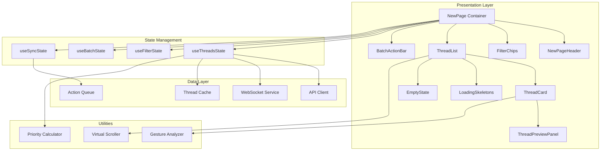
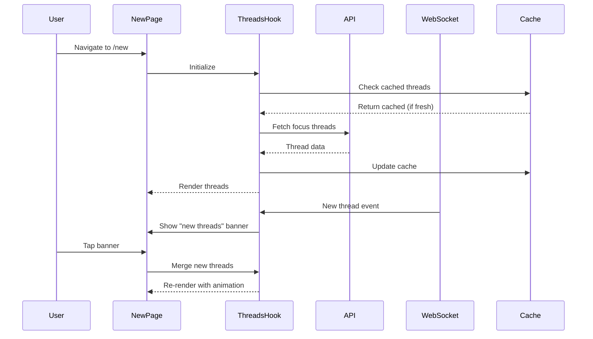

# Design Document: Enhanced New Page

## Overview

The Enhanced New Page transforms the existing Focus page into a high-tech, AI-powered communication command center for real estate agents. Built on React 18 with TypeScript, the page leverages the established Zena design system featuring glassmorphism, neon accents, and smooth animations. The architecture prioritizes performance through virtual scrolling, optimistic updates, and intelligent caching while maintaining accessibility standards.

The design follows a component-based architecture with clear separation between presentation, state management, and data fetching layers. Real-time updates are handled through WebSocket subscriptions, and offline support is provided via service worker caching and action queuing.

## Architecture



### Data Flow Architecture



## Components and Interfaces

### NewPage (Container Component)

The main page container orchestrating all sub-components and managing page-level state.

```typescript
interface NewPageProps {
  className?: string;
}

interface NewPageState {
  threads: Thread[];
  filteredThreads: Thread[];
  isLoading: boolean;
  error: Error | null;
  activeFilters: FilterType[];
  searchQuery: string;
  batchMode: boolean;
  selectedThreadIds: Set<string>;
  newThreadsAvailable: number;
  syncStatus: SyncStatus;
}
```

### ThreadCard Component

Individual thread display with glassmorphism styling and gesture support.

```typescript
interface ThreadCardProps {
  thread: Thread;
  isExpanded: boolean;
  isSelected: boolean;
  isBatchMode: boolean;
  onExpand: (threadId: string) => void;
  onSelect: (threadId: string) => void;
  onAction: (threadId: string, action: ThreadAction) => void;
  onSwipe: (threadId: string, direction: SwipeDirection) => void;
}

interface ThreadCardState {
  swipeOffset: number;
  isSwiping: boolean;
  isAnimating: boolean;
}
```

### ThreadPreviewPanel Component

Expandable panel showing detailed thread information.

```typescript
interface ThreadPreviewPanelProps {
  thread: Thread;
  isExpanded: boolean;
  onClose: () => void;
  onQuickReply: (threadId: string, replyOption: string) => void;
}
```

### FilterChips Component

Horizontal scrollable filter selection.

```typescript
interface FilterChipsProps {
  filters: FilterOption[];
  activeFilters: FilterType[];
  onFilterChange: (filters: FilterType[]) => void;
}

interface FilterOption {
  type: FilterType;
  label: string;
  count: number;
  icon?: React.ReactNode;
}

type FilterType = 'all' | 'buyer' | 'vendor' | 'market' | 'lawyer_broker' | 'high_risk';
```

### BatchActionBar Component

Floating action bar for batch operations.

```typescript
interface BatchActionBarProps {
  selectedCount: number;
  isVisible: boolean;
  onAction: (action: BatchAction) => void;
  onCancel: () => void;
}

type BatchAction = 'snooze_all' | 'archive_all' | 'mark_read';
```

### NewPageHeader Component

Page header with title, stats, and controls.

```typescript
interface NewPageHeaderProps {
  threadCount: number;
  urgentCount: number;
  isCompact: boolean;
  syncStatus: SyncStatus;
  onRefresh: () => void;
  onSearch: (query: string) => void;
}
```

### Custom Hooks

```typescript
// Thread state management
interface UseThreadsStateReturn {
  threads: Thread[];
  isLoading: boolean;
  error: Error | null;
  refresh: () => Promise<void>;
  updateThread: (threadId: string, updates: Partial<Thread>) => void;
  removeThread: (threadId: string) => void;
  mergeNewThreads: () => void;
  newThreadsCount: number;
}

// Filter state management
interface UseFilterStateReturn {
  activeFilters: FilterType[];
  searchQuery: string;
  setFilters: (filters: FilterType[]) => void;
  setSearchQuery: (query: string) => void;
  filteredThreads: Thread[];
  filterCounts: Record<FilterType, number>;
}

// Batch selection state
interface UseBatchStateReturn {
  isBatchMode: boolean;
  selectedIds: Set<string>;
  enterBatchMode: () => void;
  exitBatchMode: () => void;
  toggleSelection: (threadId: string) => void;
  selectAll: () => void;
  clearSelection: () => void;
}

// Swipe gesture handling
interface UseSwipeGestureReturn {
  swipeState: SwipeState;
  handlers: {
    onTouchStart: (e: TouchEvent) => void;
    onTouchMove: (e: TouchEvent) => void;
    onTouchEnd: () => void;
  };
}
```

## Data Models

### Thread Model

```typescript
interface Thread {
  id: string;
  subject: string;
  participants: Participant[];
  classification: ThreadClassification;
  riskLevel: RiskLevel;
  riskReason?: string;
  lastMessageAt: string;
  createdAt: string;
  draftResponse?: string;
  summary: string;
  aiSummary?: string;
  propertyId?: string;
  propertyAddress?: string;
  dealId?: string;
  dealStage?: DealStage;
  messageCount: number;
  unreadCount: number;
  lastMessages?: MessagePreview[];
  suggestedReplies?: string[];
  priorityScore?: number;
  snoozedUntil?: string;
}

interface Participant {
  id: string;
  name: string;
  email: string;
  role?: ParticipantRole;
  avatarUrl?: string;
}

interface MessagePreview {
  id: string;
  senderId: string;
  senderName: string;
  content: string;
  timestamp: string;
  isFromUser: boolean;
}

type ThreadClassification = 'buyer' | 'vendor' | 'market' | 'lawyer_broker' | 'noise';
type RiskLevel = 'none' | 'low' | 'medium' | 'high';
type ParticipantRole = 'buyer' | 'vendor' | 'agent' | 'lawyer' | 'broker' | 'other';
type DealStage = 'inquiry' | 'viewing' | 'offer' | 'negotiation' | 'conditional' | 'unconditional' | 'settled';
```

### Priority Calculation Model

```typescript
interface PriorityConfig {
  riskWeight: number;      // 0.4 (40%)
  ageWeight: number;       // 0.3 (30%)
  classificationWeight: number; // 0.3 (30%)
}

interface PriorityFactors {
  riskScore: number;       // 0-100 based on risk level
  ageScore: number;        // 0-100 based on hours since last message
  classificationScore: number; // 0-100 based on business value
}

// Classification business value mapping
const CLASSIFICATION_VALUES: Record<ThreadClassification, number> = {
  vendor: 100,      // Highest - potential listings
  buyer: 90,        // High - potential sales
  lawyer_broker: 70, // Medium-high - deal progress
  market: 40,       // Medium - opportunities
  noise: 10         // Low - spam/irrelevant
};
```

### Action Models

```typescript
type ThreadAction = 'view' | 'snooze' | 'send_draft' | 'archive' | 'mark_read';

interface SnoozeOptions {
  duration: '1h' | '4h' | 'tomorrow' | 'next_week' | 'custom';
  customDate?: string;
}

interface ActionResult {
  success: boolean;
  threadId: string;
  action: ThreadAction;
  error?: string;
  timestamp: string;
}

type SwipeDirection = 'left' | 'right';

interface SwipeState {
  threadId: string | null;
  startX: number;
  currentX: number;
  direction: SwipeDirection | null;
  isSwiping: boolean;
  threshold: number; // 80px
}
```

### Sync and Cache Models

```typescript
type SyncStatus = 'idle' | 'syncing' | 'error' | 'offline';

interface CacheEntry<T> {
  data: T;
  timestamp: number;
  ttl: number; // Time to live in ms
}

interface QueuedAction {
  id: string;
  threadId: string;
  action: ThreadAction;
  payload?: unknown;
  timestamp: string;
  retryCount: number;
}
```


## Correctness Properties

*A property is a characteristic or behavior that should hold true across all valid executions of a system-essentially, a formal statement about what the system should do. Properties serve as the bridge between human-readable specifications and machine-verifiable correctness guarantees.*

### Property 1: Priority Score Calculation Consistency

*For any* thread with valid risk level, classification, and lastMessageAt timestamp, the calculated priority score SHALL equal: (riskScore × 0.4) + (ageScore × 0.3) + (classificationScore × 0.3), where each component score is between 0-100.

**Validates: Requirements 2.1**

### Property 2: Thread Sort Order Invariant

*For any* list of threads displayed in the New page, the threads SHALL be ordered such that for every adjacent pair (thread[i], thread[i+1]), thread[i].priorityScore >= thread[i+1].priorityScore.

**Validates: Requirements 2.2**

### Property 3: Risk Level Indicator Styling

*For any* thread with a non-none risk level, the rendered Thread_Card SHALL contain an Urgency_Indicator element with the correct color: high → #FF4444, medium → #FFAA00, low → #00FF88.

**Validates: Requirements 2.3, 2.4**

### Property 4: Response Overdue Badge Display

*For any* thread where (currentTime - lastMessageAt) exceeds 48 hours, the rendered Thread_Card SHALL contain a "Response Overdue" badge element.

**Validates: Requirements 2.5**

### Property 5: Thread Card Required Elements

*For any* thread rendered as a Thread_Card, the card SHALL contain all required elements: classification badge, subject line, at least one participant name, summary text, and timestamp.

**Validates: Requirements 3.1**

### Property 6: Participant Display Limit

*For any* thread with N participants where N > 3, the Thread_Card SHALL display exactly 3 participant names plus a "+{N-3} more" indicator.

**Validates: Requirements 3.3**

### Property 7: Linked Entity Badge Presence

*For any* thread with a non-null propertyId, the Thread_Card SHALL contain a property badge. *For any* thread with a non-null dealId, the Thread_Card SHALL contain a deal stage indicator.

**Validates: Requirements 3.4, 3.5**

### Property 8: Draft Indicator Presence

*For any* thread with a non-empty draftResponse, the Thread_Card SHALL contain a "Draft Ready" indicator badge.

**Validates: Requirements 3.2**

### Property 9: Snooze Action Thread Removal

*For any* thread that receives a successful snooze action, the thread SHALL be removed from the displayed thread list within 500ms.

**Validates: Requirements 4.3**

### Property 10: Action Feedback Toast Display

*For any* action (snooze, send_draft, archive) that completes, the system SHALL display a toast notification. Success actions display success styling; failed actions display error styling with retry option.

**Validates: Requirements 4.5, 4.6**

### Property 11: Swipe Threshold Action Reveal

*For any* swipe gesture on a Thread_Card, when |swipeOffset| exceeds 80px, the corresponding action indicator SHALL be visible (left swipe → snooze indicator, right swipe → view indicator).

**Validates: Requirements 5.1, 5.2**

### Property 12: Swipe Action Execution

*For any* swipe gesture released with |swipeOffset| > 80px, the corresponding action SHALL be executed (left → snooze, right → navigate to thread).

**Validates: Requirements 5.3**

### Property 13: Swipe Cancel Reset

*For any* swipe gesture released with |swipeOffset| <= 80px, the Thread_Card transform SHALL return to translateX(0) within 300ms.

**Validates: Requirements 5.4**

### Property 14: Swipe Indicator Opacity Proportionality

*For any* active swipe gesture, the action indicator opacity SHALL equal min(1, |swipeOffset| / 80).

**Validates: Requirements 5.5**

### Property 15: Filter Application Correctness

*For any* set of active filters, the displayed threads SHALL only include threads whose classification matches at least one active filter (or all threads if 'all' filter is active).

**Validates: Requirements 6.2**

### Property 16: Multi-Filter AND Logic

*For any* combination of active filters excluding 'all', the displayed threads SHALL match ALL active filter criteria simultaneously.

**Validates: Requirements 6.3**

### Property 17: Search Filter Correctness

*For any* non-empty search query, the displayed threads SHALL only include threads where the subject, any participant name, or summary contains the search query (case-insensitive).

**Validates: Requirements 6.5**

### Property 18: Batch Mode Selection Toggle

*For any* Thread_Card tapped while in Batch_Action_Mode, the thread's selection state SHALL toggle (selected → unselected, unselected → selected).

**Validates: Requirements 7.3**

### Property 19: Batch Selection Count Accuracy

*For any* state in Batch_Action_Mode, the displayed selection count SHALL equal the cardinality of the selectedThreadIds set.

**Validates: Requirements 7.4**

### Property 20: Batch Action Bar Visibility

*For any* state where isBatchMode is true, the BatchActionBar component SHALL be visible. *For any* state where isBatchMode is false, the BatchActionBar SHALL not be visible.

**Validates: Requirements 7.2**

### Property 21: New Threads Banner Display

*For any* state where newThreadsAvailable > 0, the "New threads available" banner SHALL be visible.

**Validates: Requirements 8.1**

### Property 22: Thread Update Reflection

*For any* thread that receives an external update, the corresponding Thread_Card content SHALL reflect the updated values within 100ms of state update.

**Validates: Requirements 8.3**

### Property 23: Sync Status Indicator Visibility

*For any* state where syncStatus equals 'syncing', the sync indicator SHALL be visible in the header.

**Validates: Requirements 8.4**

### Property 24: Loading Skeleton Count

*For any* state where isLoading is true and threads array is empty, the system SHALL render between 3 and 5 Shimmer_Skeleton components.

**Validates: Requirements 9.1**

### Property 25: Empty State Display

*For any* state where isLoading is false and threads array is empty and error is null, the AnimatedEmptyState component SHALL be visible.

**Validates: Requirements 9.2**

### Property 26: Error State Display

*For any* state where error is not null, the error state component with retry button SHALL be visible.

**Validates: Requirements 9.3**

### Property 27: Reduced Motion Animation Disable

*For any* user with prefers-reduced-motion: reduce, all CSS animation-duration and transition-duration values SHALL be 0.01ms or less.

**Validates: Requirements 10.1**

### Property 28: Touch Target Minimum Size

*For any* interactive element (button, link, checkbox) within Thread_Card, the element's computed width and height SHALL both be >= 44px.

**Validates: Requirements 10.2**

### Property 29: Text Contrast Compliance

*For any* text element displayed against the dark background, the contrast ratio between text color and background color SHALL be >= 4.5:1.

**Validates: Requirements 10.3**

### Property 30: Virtual Scrolling Activation

*For any* thread list with length > 20, the number of rendered Thread_Card DOM elements SHALL be less than the total thread count (indicating virtual scrolling is active).

**Validates: Requirements 10.4**

### Property 31: ARIA Label Presence

*For any* interactive element (button, link, input), the element SHALL have either an aria-label attribute, aria-labelledby attribute, or visible text content.

**Validates: Requirements 10.6**

### Property 32: Single Expansion Invariant

*For any* state of the thread list, at most one Thread_Card SHALL have isExpanded = true at any time.

**Validates: Requirements 11.3**

### Property 33: Expanded Panel Required Content

*For any* expanded Thread_Preview_Panel, the panel SHALL contain: AI summary section, message previews section, and suggested replies section (if suggestedReplies exists).

**Validates: Requirements 11.2**

### Property 34: Suggested Reply Limit

*For any* Thread_Preview_Panel displaying suggested replies, the number of displayed reply options SHALL be <= 3.

**Validates: Requirements 11.6**

### Property 35: Header Thread Count Accuracy

*For any* loaded state, the header thread count SHALL equal the length of the threads array, and the urgent count SHALL equal the count of threads with riskLevel === 'high'.

**Validates: Requirements 12.2**

### Property 36: Urgent Notification Dot Display

*For any* state where at least one thread has riskLevel === 'high', the header SHALL display a pulsing notification dot.

**Validates: Requirements 12.6**

### Property 37: Header Compact on Scroll

*For any* scroll position > 100px, the header SHALL be in compact mode (reduced height).

**Validates: Requirements 12.5**

## Error Handling

### API Error Handling

```typescript
interface ErrorState {
  type: 'network' | 'auth' | 'server' | 'validation';
  message: string;
  retryable: boolean;
  retryAction?: () => Promise<void>;
}

// Error handling strategy
const handleApiError = (error: unknown): ErrorState => {
  if (error instanceof NetworkError) {
    return {
      type: 'network',
      message: 'Unable to connect. Check your internet connection.',
      retryable: true,
    };
  }
  if (error instanceof AuthError) {
    return {
      type: 'auth',
      message: 'Session expired. Please log in again.',
      retryable: false,
    };
  }
  // Default server error
  return {
    type: 'server',
    message: 'Something went wrong. Please try again.',
    retryable: true,
  };
};
```

### Offline Action Queuing

When offline, actions are queued and executed when connectivity is restored:

```typescript
interface OfflineQueue {
  add: (action: QueuedAction) => void;
  process: () => Promise<void>;
  clear: () => void;
  getQueueLength: () => number;
}

// Actions are processed in FIFO order with exponential backoff on failure
const processQueue = async (queue: QueuedAction[]) => {
  for (const action of queue) {
    try {
      await executeAction(action);
      removeFromQueue(action.id);
    } catch (error) {
      if (action.retryCount < MAX_RETRIES) {
        action.retryCount++;
        await delay(Math.pow(2, action.retryCount) * 1000);
      } else {
        notifyActionFailed(action);
        removeFromQueue(action.id);
      }
    }
  }
};
```

### Optimistic Updates with Rollback

```typescript
const executeOptimisticAction = async <T>(
  optimisticUpdate: () => void,
  apiCall: () => Promise<T>,
  rollback: () => void
): Promise<T> => {
  optimisticUpdate();
  try {
    return await apiCall();
  } catch (error) {
    rollback();
    throw error;
  }
};
```

## Testing Strategy

### Unit Testing Approach

Unit tests will cover:
- Priority score calculation with various input combinations
- Filter logic for single and multiple filters
- Search matching algorithm
- Swipe gesture threshold detection
- Batch selection state management
- Thread sorting algorithm

Testing framework: Vitest with React Testing Library

### Property-Based Testing Approach

Property-based tests will use **fast-check** library to verify correctness properties across randomly generated inputs.

Each property-based test MUST:
- Run a minimum of 100 iterations
- Be tagged with the format: `**Feature: enhanced-new-page, Property {number}: {property_text}**`
- Generate realistic thread data using custom arbitraries

Example test structure:
```typescript
import fc from 'fast-check';
import { calculatePriorityScore } from './priorityCalculator';

describe('Priority Score Calculation', () => {
  it('should calculate score within valid range', () => {
    // **Feature: enhanced-new-page, Property 1: Priority Score Calculation Consistency**
    fc.assert(
      fc.property(
        threadArbitrary,
        (thread) => {
          const score = calculatePriorityScore(thread);
          return score >= 0 && score <= 100;
        }
      ),
      { numRuns: 100 }
    );
  });
});
```

### Custom Arbitraries for Thread Generation

```typescript
const riskLevelArb = fc.constantFrom('none', 'low', 'medium', 'high');
const classificationArb = fc.constantFrom('buyer', 'vendor', 'market', 'lawyer_broker', 'noise');

const participantArb = fc.record({
  id: fc.uuid(),
  name: fc.string({ minLength: 1, maxLength: 50 }),
  email: fc.emailAddress(),
  role: fc.option(fc.constantFrom('buyer', 'vendor', 'agent', 'lawyer', 'broker', 'other')),
});

const threadArbitrary = fc.record({
  id: fc.uuid(),
  subject: fc.string({ minLength: 1, maxLength: 200 }),
  participants: fc.array(participantArb, { minLength: 1, maxLength: 10 }),
  classification: classificationArb,
  riskLevel: riskLevelArb,
  lastMessageAt: fc.date({ min: new Date('2024-01-01'), max: new Date() }).map(d => d.toISOString()),
  summary: fc.string({ minLength: 10, maxLength: 500 }),
  draftResponse: fc.option(fc.string({ minLength: 1, maxLength: 1000 })),
  propertyId: fc.option(fc.uuid()),
  dealId: fc.option(fc.uuid()),
});
```

### Integration Testing

Integration tests will verify:
- Component composition and data flow
- API integration with mock server
- WebSocket event handling
- Gesture recognition accuracy
- Animation timing and sequencing

### Accessibility Testing

- Automated axe-core scans for WCAG violations
- Manual keyboard navigation testing
- Screen reader compatibility testing with VoiceOver/NVDA
- Color contrast verification

