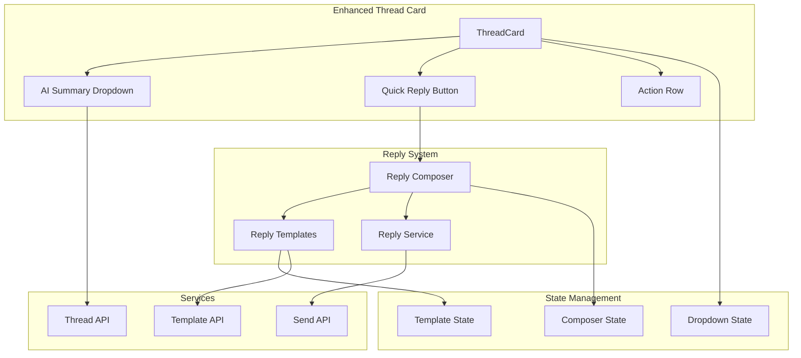
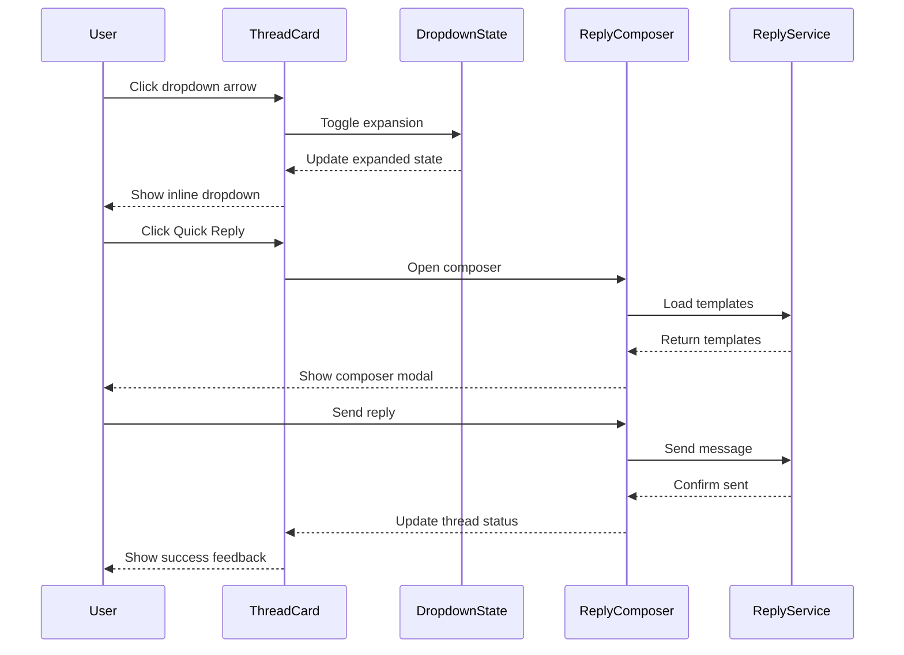

# Design Document: New Page Dropdown Fixes and Quick Reply

## Overview

This design addresses critical UI issues in the New Page thread interface and adds essential quick reply functionality for busy real estate agents. The solution fixes screen blurring on dropdown interactions, ensures consistent AI summary dropdown behavior across all thread cards, and implements a streamlined quick reply system that enables rapid response without leaving the inbox view.

The design maintains the existing high-tech glassmorphism aesthetic while improving usability through better component architecture, proper CSS isolation, and enhanced user interactions. The implementation focuses on inline expansions rather than overlay modals to prevent backdrop filter conflicts and provides a more integrated user experience.

## Architecture



### Component Interaction Flow



## Components and Interfaces

### Enhanced ThreadCard Component

The ThreadCard component is enhanced to include inline dropdown functionality and quick reply button.

```typescript
interface EnhancedThreadCardProps extends ThreadCardProps {
  /** Whether the inline dropdown is expanded */
  isDropdownExpanded?: boolean;
  /** Callback when dropdown toggle is clicked */
  onDropdownToggle?: (threadId: string) => void;
  /** Callback when quick reply button is clicked */
  onQuickReply?: (threadId: string) => void;
  /** Whether to show the quick reply button */
  showQuickReply?: boolean;
}

interface ThreadCardState {
  isAnimating: boolean;
  dropdownHeight: number;
  hasLoadingError: boolean;
}
```

### AI Summary Dropdown Component

Inline dropdown component that expands within the ThreadCard container.

```typescript
interface AISummaryDropdownProps {
  /** Thread data for summary display */
  thread: Thread;
  /** Whether the dropdown is expanded */
  isExpanded: boolean;
  /** Whether content is loading */
  isLoading?: boolean;
  /** Loading error if any */
  error?: Error | null;
  /** Callback for action button clicks */
  onAction?: (action: DropdownAction) => void;
  /** Callback for retry on error */
  onRetry?: () => void;
}

interface DropdownContent {
  aiSummary: string;
  sentimentAnalysis?: SentimentData;
  urgencyIndicators: UrgencyIndicator[];
  recommendedActions: RecommendedAction[];
  linkedEntities: LinkedEntity[];
  participantCards: ParticipantCard[];
}

type DropdownAction = 'quick_reply' | 'schedule_followup' | 'mark_priority';
```

### Quick Reply Button Component

Prominent button with cyan glow styling for initiating quick replies.

```typescript
interface QuickReplyButtonProps {
  /** Thread ID for reply context */
  threadId: string;
  /** Whether the button is disabled */
  disabled?: boolean;
  /** Click handler */
  onClick: (threadId: string) => void;
  /** Optional className for styling */
  className?: string;
}
```

### Reply Composer Component

Modal interface for composing and sending quick replies.

```typescript
interface ReplyComposerProps {
  /** Whether the composer is open */
  isOpen: boolean;
  /** Thread context for reply */
  thread: Thread;
  /** Available reply templates */
  templates: ReplyTemplate[];
  /** Whether templates are loading */
  templatesLoading?: boolean;
  /** Callback when composer should close */
  onClose: () => void;
  /** Callback when reply is sent */
  onSend: (replyData: ReplyData) => Promise<void>;
  /** Callback when template is selected */
  onTemplateSelect: (template: ReplyTemplate) => void;
}

interface ReplyData {
  threadId: string;
  recipients: string[];
  subject: string;
  message: string;
  templateId?: string;
}

interface ReplyTemplate {
  id: string;
  name: string;
  content: string;
  classification: ThreadClassification;
  category: 'greeting' | 'followup' | 'scheduling' | 'closing' | 'information';
}
```

### State Management Hooks

```typescript
// Dropdown state management
interface UseDropdownStateReturn {
  expandedDropdownId: string | null;
  toggleDropdown: (threadId: string) => void;
  closeAllDropdowns: () => void;
  isDropdownExpanded: (threadId: string) => boolean;
}

// Reply composer state management
interface UseReplyComposerReturn {
  isOpen: boolean;
  currentThread: Thread | null;
  templates: ReplyTemplate[];
  templatesLoading: boolean;
  sendingState: SendingState;
  openComposer: (thread: Thread) => void;
  closeComposer: () => void;
  sendReply: (replyData: ReplyData) => Promise<void>;
  selectTemplate: (template: ReplyTemplate) => void;
}

type SendingState = 'idle' | 'sending' | 'success' | 'error';
```

## Data Models

### Enhanced Thread Model

Extension of the existing Thread model to support dropdown and reply functionality.

```typescript
interface EnhancedThread extends Thread {
  /** Enhanced AI summary with entity highlighting */
  enhancedAISummary?: EnhancedSummary;
  /** Sentiment analysis data */
  sentimentAnalysis?: SentimentData;
  /** Urgency indicators */
  urgencyIndicators?: UrgencyIndicator[];
  /** Recommended actions for this thread */
  recommendedActions?: RecommendedAction[];
  /** Available reply templates */
  availableTemplates?: string[]; // Template IDs
}

interface EnhancedSummary {
  content: string;
  highlightedEntities: HighlightedEntity[];
  keyPoints: string[];
  actionItems: string[];
}

interface HighlightedEntity {
  text: string;
  type: 'person' | 'property' | 'date' | 'amount' | 'location';
  startIndex: number;
  endIndex: number;
  confidence: number;
}

interface SentimentData {
  overall: 'positive' | 'neutral' | 'negative';
  confidence: number;
  emotions: EmotionScore[];
}

interface EmotionScore {
  emotion: 'joy' | 'anger' | 'fear' | 'sadness' | 'surprise' | 'trust';
  score: number; // 0-1
}

interface UrgencyIndicator {
  type: 'time_sensitive' | 'high_value' | 'relationship_risk' | 'deadline_approaching';
  level: 'low' | 'medium' | 'high';
  description: string;
  icon: string;
}

interface RecommendedAction {
  id: string;
  type: DropdownAction;
  label: string;
  description: string;
  priority: number;
  icon: string;
}
```

### Reply Template Model

```typescript
interface ReplyTemplate {
  id: string;
  name: string;
  content: string;
  classification: ThreadClassification;
  category: TemplateCategory;
  variables: TemplateVariable[];
  usage_count: number;
  effectiveness_score: number; // 0-1 based on response rates
}

type TemplateCategory = 'greeting' | 'followup' | 'scheduling' | 'closing' | 'information' | 'negotiation';

interface TemplateVariable {
  name: string;
  type: 'text' | 'date' | 'amount' | 'property_address';
  required: boolean;
  default_value?: string;
}
```

### Animation and Transition Models

```typescript
interface DropdownAnimation {
  duration: number; // 300ms
  easing: 'ease-out';
  properties: AnimationProperty[];
}

interface AnimationProperty {
  property: 'height' | 'opacity' | 'transform';
  from: string | number;
  to: string | number;
}

interface BlurPreventionConfig {
  preventBackdropFilter: boolean;
  isolateTransforms: boolean;
  useWillChange: boolean;
  optimizeLayering: boolean;
}
```

## Correctness Properties

*A property is a characteristic or behavior that should hold true across all valid executions of a system-essentially, a formal statement about what the system should do. Properties serve as the bridge between human-readable specifications and machine-verifiable correctness guarantees.*

### Property 1: Dropdown Blur Prevention

*For any* dropdown expansion or collapse operation, no backdrop-filter CSS properties SHALL be applied to parent elements outside the ThreadCard component.

**Validates: Requirements 1.1, 1.2, 1.3, 1.4**

### Property 2: Single Dropdown Expansion

*For any* state of the thread list, at most one AI_Summary_Dropdown SHALL have isExpanded = true at any time.

**Validates: Requirements 2.5**

### Property 3: Consistent Dropdown Behavior

*For any* ThreadCard component, clicking the dropdown arrow SHALL always result in the same expansion behavior regardless of thread content or classification.

**Validates: Requirements 2.1, 2.4**

### Property 4: Dropdown Content Completeness

*For any* expanded AI_Summary_Dropdown, the dropdown SHALL contain all required sections: AI summary, recommended actions (max 3), and linked entities (when available).

**Validates: Requirements 2.2, 6.1, 6.3**

### Property 5: Animation Timing Consistency

*For any* dropdown expansion or collapse, the animation SHALL complete within 300ms ± 50ms tolerance.

**Validates: Requirements 2.3, 7.1**

### Property 6: Quick Reply Button Presence

*For any* rendered ThreadCard, a Quick Reply button SHALL be present and visible with cyan glow styling.

**Validates: Requirements 3.1**

### Property 7: Reply Composer Initialization

*For any* Quick Reply button click, the Reply_Composer SHALL open with pre-populated recipients matching the thread participants and focused message input.

**Validates: Requirements 3.2, 3.3**

### Property 8: Template Limit Enforcement

*For any* Reply_Composer display, the number of visible reply templates SHALL be <= 5.

**Validates: Requirements 5.2**

### Property 9: Thread Removal After Reply

*For any* successfully sent quick reply, the corresponding thread SHALL be removed from the New page thread list within 1000ms.

**Validates: Requirements 3.7**

### Property 10: Action Row Layout Order

*For any* ThreadCard action row, the Quick_Reply_Button SHALL appear before the dropdown arrow in DOM order.

**Validates: Requirements 4.1, 4.2**

### Property 11: Touch Target Accessibility

*For any* interactive element (Quick Reply button, dropdown arrow) within ThreadCard, the element's computed width and height SHALL both be >= 44px.

**Validates: Requirements 4.3**

### Property 12: Entity Highlighting Presence

*For any* AI summary containing detected entities, each entity SHALL have appropriate color-coded highlighting applied.

**Validates: Requirements 6.2**

### Property 13: Send Button Validation

*For any* Reply_Composer state, the send button SHALL be enabled if and only if the message content is non-empty and recipients are valid.

**Validates: Requirements 5.4**

### Property 14: Duplicate Send Prevention

*For any* reply sending operation in progress, additional send button clicks SHALL be ignored until the operation completes.

**Validates: Requirements 5.5**

### Property 15: Error Message Preservation

*For any* failed reply send operation, the composed message content SHALL be preserved in the Reply_Composer for retry.

**Validates: Requirements 5.7, 8.3**

### Property 16: Fallback Content Display

*For any* thread lacking AI summary data, the dropdown SHALL display the regular summary with a "AI analysis pending" note.

**Validates: Requirements 2.6, 8.1**

### Property 17: Keyboard Navigation Order

*For any* expanded dropdown content, tab navigation SHALL follow logical order: action buttons, entity cards, then participant cards.

**Validates: Requirements 7.3**

### Property 18: ARIA State Announcements

*For any* dropdown state change, appropriate ARIA live region updates SHALL be triggered for screen reader users.

**Validates: Requirements 7.4**

### Property 19: Reduced Motion Compliance

*For any* user with prefers-reduced-motion: reduce, all dropdown animations SHALL use instant transitions (duration <= 0.01ms).

**Validates: Requirements 7.5**

### Property 20: Haptic Feedback Activation

*For any* touch interaction on Quick Reply button or dropdown arrow, haptic feedback SHALL be triggered if the device supports it.

**Validates: Requirements 7.6**

### Property 21: Offline Reply Queuing

*For any* reply sent while offline, the reply SHALL be queued and automatically sent when connectivity is restored.

**Validates: Requirements 8.2**

### Property 22: Conflict Detection

*For any* thread modified by concurrent users, attempting to send a reply SHALL trigger a conflict detection prompt.

**Validates: Requirements 8.5**

### Property 23: Real-time Update Notification

*For any* thread update received while Reply_Composer is open for that thread, a non-disruptive notification SHALL be displayed.

**Validates: Requirements 8.6**

### Property 24: Performance Animation Limit

*For any* state with multiple ThreadCards, simultaneous dropdown animations SHALL be limited to prevent performance degradation below 60fps.

**Validates: Requirements 7.2**

### Property 25: Template Classification Matching

*For any* thread with classification C, the displayed reply templates SHALL only include templates where template.classification matches C or is universal.

**Validates: Requirements 3.4**

## Error Handling

### Dropdown Content Loading Errors

```typescript
interface DropdownErrorState {
  type: 'network' | 'parsing' | 'timeout' | 'unauthorized';
  message: string;
  retryable: boolean;
  fallbackContent?: Partial<DropdownContent>;
}

const handleDropdownError = (error: unknown, thread: Thread): DropdownErrorState => {
  if (error instanceof NetworkError) {
    return {
      type: 'network',
      message: 'Unable to load enhanced content. Showing basic information.',
      retryable: true,
      fallbackContent: {
        aiSummary: thread.summary,
        recommendedActions: [
          { id: 'quick_reply', type: 'quick_reply', label: 'Quick Reply', description: 'Send a quick response', priority: 1, icon: 'reply' }
        ]
      }
    };
  }
  
  return {
    type: 'parsing',
    message: 'Content temporarily unavailable.',
    retryable: true,
    fallbackContent: { aiSummary: thread.summary }
  };
};
```

### Reply Sending Error Handling

```typescript
interface ReplyErrorState {
  type: 'network' | 'validation' | 'server' | 'conflict';
  message: string;
  retryable: boolean;
  retryDelay?: number;
  preserveContent: boolean;
}

const handleReplyError = (error: unknown, attempt: number): ReplyErrorState => {
  if (error instanceof ConflictError) {
    return {
      type: 'conflict',
      message: 'This thread has been updated by another user. Please refresh and try again.',
      retryable: false,
      preserveContent: true
    };
  }
  
  if (error instanceof NetworkError) {
    return {
      type: 'network',
      message: 'Reply will be sent when connection is restored.',
      retryable: true,
      retryDelay: Math.min(1000 * Math.pow(2, attempt), 30000), // Exponential backoff
      preserveContent: true
    };
  }
  
  return {
    type: 'server',
    message: 'Failed to send reply. Please try again.',
    retryable: true,
    preserveContent: true
  };
};
```

### Animation Performance Safeguards

```typescript
interface PerformanceMonitor {
  frameRate: number;
  activeAnimations: number;
  maxConcurrentAnimations: number;
}

const shouldThrottleAnimation = (monitor: PerformanceMonitor): boolean => {
  return monitor.frameRate < 55 || monitor.activeAnimations >= monitor.maxConcurrentAnimations;
};

const optimizeAnimationPerformance = (element: HTMLElement) => {
  // Use CSS containment for better performance
  element.style.contain = 'layout style paint';
  
  // Promote to composite layer for smooth animations
  element.style.willChange = 'height, opacity';
  
  // Clean up after animation
  element.addEventListener('transitionend', () => {
    element.style.willChange = 'auto';
  }, { once: true });
};
```

## Testing Strategy

### Unit Testing Approach

Unit tests will cover:
- Dropdown state management and single expansion invariant
- Quick reply button click handling and composer opening
- Reply template filtering and selection logic
- Animation timing and CSS class application
- Error state handling and fallback content display
- Touch target size validation
- ARIA attribute presence and correctness

Testing framework: Vitest with React Testing Library

### Property-Based Testing Approach

Property-based tests will use **fast-check** library to verify correctness properties across randomly generated inputs.

Each property-based test MUST:
- Run a minimum of 100 iterations
- Be tagged with the format: `**Feature: new-page-dropdown-fixes, Property {number}: {property_text}**`
- Generate realistic thread and template data using custom arbitraries

Example test structure:
```typescript
import fc from 'fast-check';
import { render, fireEvent } from '@testing-library/react';
import { ThreadCard } from './ThreadCard';

describe('Dropdown Behavior Properties', () => {
  it('should prevent backdrop blur effects during expansion', () => {
    // **Feature: new-page-dropdown-fixes, Property 1: Dropdown Blur Prevention**
    fc.assert(
      fc.property(
        threadArbitrary,
        (thread) => {
          const { container } = render(<ThreadCard thread={thread} />);
          const dropdownButton = container.querySelector('[data-testid="dropdown-arrow"]');
          
          fireEvent.click(dropdownButton);
          
          // Verify no backdrop-filter is applied to parent elements
          const parentElements = getParentElements(container);
          return parentElements.every(el => 
            !getComputedStyle(el).backdropFilter || 
            getComputedStyle(el).backdropFilter === 'none'
          );
        }
      ),
      { numRuns: 100 }
    );
  });
});
```

### Custom Arbitraries for Testing

```typescript
const replyTemplateArb = fc.record({
  id: fc.uuid(),
  name: fc.string({ minLength: 5, maxLength: 50 }),
  content: fc.string({ minLength: 20, maxLength: 500 }),
  classification: fc.constantFrom('buyer', 'vendor', 'market', 'lawyer_broker', 'noise'),
  category: fc.constantFrom('greeting', 'followup', 'scheduling', 'closing', 'information'),
  variables: fc.array(fc.record({
    name: fc.string({ minLength: 1, maxLength: 20 }),
    type: fc.constantFrom('text', 'date', 'amount', 'property_address'),
    required: fc.boolean()
  }), { maxLength: 5 })
});

const enhancedThreadArb = fc.record({
  ...threadArbitrary.constraints,
  enhancedAISummary: fc.option(fc.record({
    content: fc.string({ minLength: 50, maxLength: 1000 }),
    highlightedEntities: fc.array(fc.record({
      text: fc.string({ minLength: 1, maxLength: 50 }),
      type: fc.constantFrom('person', 'property', 'date', 'amount', 'location'),
      startIndex: fc.nat(),
      endIndex: fc.nat(),
      confidence: fc.float({ min: 0, max: 1 })
    }), { maxLength: 10 }),
    keyPoints: fc.array(fc.string({ minLength: 10, maxLength: 100 }), { maxLength: 5 })
  })),
  availableTemplates: fc.array(fc.uuid(), { maxLength: 10 })
});
```

### Integration Testing

Integration tests will verify:
- Complete dropdown expansion and collapse cycles
- Reply composer workflow from open to send
- Template loading and selection integration
- Error recovery and retry mechanisms
- Real-time update handling during composition
- Performance under concurrent animations

### Accessibility Testing

- Automated axe-core scans for WCAG violations
- Manual keyboard navigation through dropdown content
- Screen reader testing with NVDA/VoiceOver
- Touch target size verification on mobile devices
- Color contrast validation for entity highlighting
- Reduced motion preference compliance testing